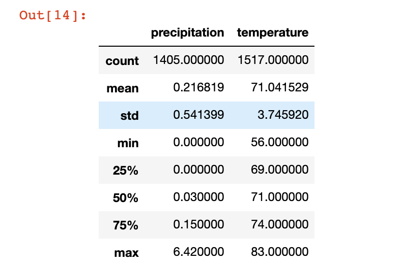
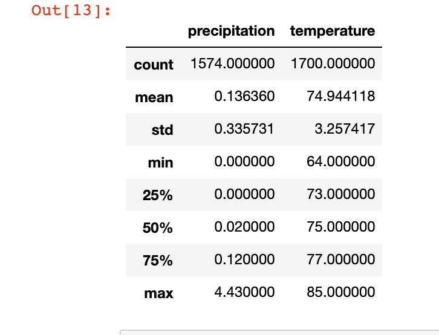

# surfs_up
Jupyter Notebook, VS Code, and Github are our tools for this Repository.
# Backgroud on project!
### W. Avy likes your analysis, but he wants more information about temperature trends before opening the surf shop. Specifically, he wants temperature data for the months of June and December in Oahu, in order to determine if the surf and ice cream shop business is sustainable year-round.
# Challenge requirements
### Using Python, Pandas functions and methods, and SQLAlchemy, you’ll filter the date column of the Measurements table in the hawaii.sqlite database to retrieve all the temperatures for the month of June. You’ll then convert those temperatures to a list, create a DataFrame from the list, and generate the summary statistics.
### Using Python, Pandas functions and methods, and SQLAlchemy, you’ll filter the date column of the Measurements table in the hawaii.sqlite database to retrieve all the temperatures for the month of December. You’ll then convert those temperatures to a list, create a DataFrame from the list, and generate the summary statistics.
# CSVs Produced by the Challenge
[december.csv](december.csv)

## And
[june.csv](june.csv)

